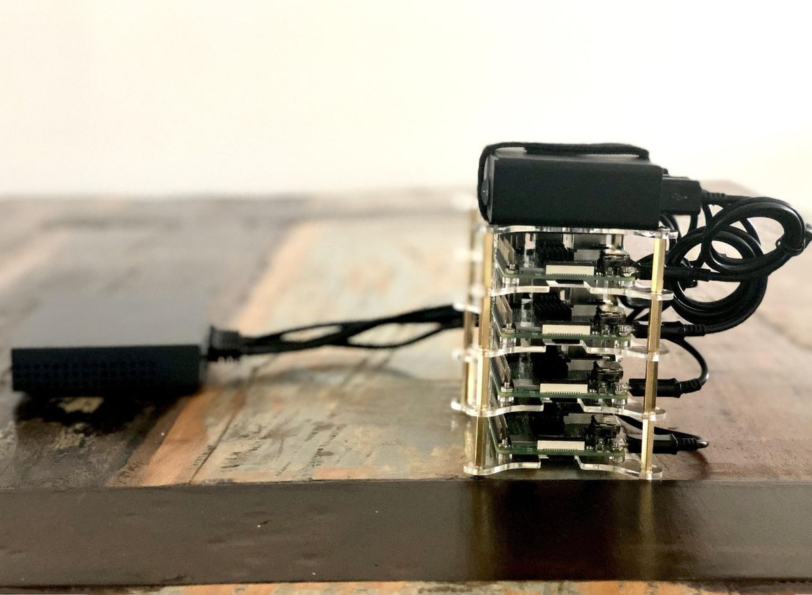

# Introduction

[k3s](https://k3s.io/) by Rancher is intended to be a fully compliant lightweight Kubernetes Distribution which is easy to install, uses 512 of RAM and the binary only takes 40MB.

I want to automate as much as possible the installation of a k3s cluster build with multiple `Raspberry Pi 3 Model B+`.

k3s doesn't support  [a high availabilty control plane yet](https://github.com/rancher/k3s#server-ha)

The `init.sh` script has only been tested on MacOS but should also work on GNU Linux machine.

All the command and script below will run on your computer, no need to log into any Raspberry.

I live in Canada so all the hardware can be bought here.

# To do

* Generate a SSH key pair instead of using your own.
* Automate k3S bootstrap in `post-install.txt`.

# Hardware

* Raspberry Pi 3 Model B+:
    * https://www.buyapi.ca/
    * https://www.canakit.com/

* Heatsink Cooler:
    * https://www.amazon.ca/dp/B010ER7UN8/ref=pe_3034960_236394800_TE_dp_5

* Switch:
    * https://www.amazon.ca/dp/B00A121WN6/ref=cm_sw_em_r_mt_dp_U_KerOCbHFS5XZ8

* Case:
    * https://www.amazon.ca/ILS-Clear-Acrylic-Cluster-Raspberry/dp/B0768DDTKD

* USB HUB:
    * https://www.amazon.ca/dp/B00YRYS4T4/ref=pe_3034960_236394800_TE_dp_4

* Micro SD card:
    * https://www.amazon.ca/dp/B010Q57T02/ref=pe_3034960_236394800_TE_dp_2

* USB 2.0 to Micro 5Pin USB cables:
    * https://www.primecables.ca/p-309029-at-usb2-micro5p-all-premium-usb-20-to-micro-5pin-usb-chargesync-cable-black-primecables?atc_source=search%23Premium+USB+2.0+to+Micro+5Pin+USB+Charge%26Sync+Cable+-+Black+-+PrimeCables%C2%AE+-+1.5ft#sku309029

* 1FT 24AWG Cat5e Ethernet Network cable:
    * https://www.primecables.ca/p-313033-cab-1978-all-1ft-24awg-cat5e-350mhz-utp-bare-copper-ethernet-network-cable-monoprice?atc_source=search%231FT+24AWG+Cat5e+350MHz+UTP+Bare+Copper+Ethernet+Network+Cable+-+Monoprice%C2%AE+-+Black#sku313020


# Prerequisites

* Install balenaEtcher https://www.balena.io/etcher/ on your computer or use `dd` on the command line.
* Disable `Auto-unmount on success` in balenaEtcher's settings.
* Download the latest `raspberrypi-ua-netinst-v<VERSION>.img.bz2`: https://github.com/FooDeas/raspberrypi-ua-netinst/releases/latest

# Create the master node

## Burn the image

* Use balenaEtcher to burn `raspberrypi-ua-netinst-v<VERSION>.img.bz2` on the SD card.

## Create the unattended config files

``` sh
export HOSTNAME="<master hostname>"
export MASTER_IP="<master IP>"
export ROOT_SSH_PUBKEY="<YOUR SSH PUBLIC KEY>"
export IP="${MASTER_IP}"
export IP_NETMASK="<Network mask>"      # IP_NETMASK=255.255.255.0 if not set
export IP_GATEWAY="<Network GW IP>"     # IP_GATEWAY=192.168.7.1 if not set
export NAMESERVER="<DNS name server>"   # DNSSERVER=192.168.7.1 if not set
export DOMAIN_NAME="<domain name>"      # DOMAIN_NAME=local if not set
export WLAN_COUNTRY="<WLAN country>"    # WLAN_COUNTRY=CA if not set https://github.com/FooDeas/raspberrypi-ua-netinst/blob/devel/doc/wlan_country.txt
export TZ="<Time zone>"                 # TZ="America/Toronto" if not set https://github.com/FooDeas/raspberrypi-ua-netinst/blob/devel/doc/timezone.txt

./init.sh
```

## Install Raspbian

* Start the raspbery Pi with the master SD card.
* It will take around 10 minutes for the installation to be completed.
* When ready test ssh connectivity:
``` sh
ssh -l root ${HOSTNAME}.local -t hostname
```
## Install k3s control plane

```sh
ssh -l root ${MASTER_IP} <<-\SSH
# install k3s
curl -sfL https://get.k3s.io | sh -
SSH
```
* test if Kubernetes is up
```sh
ssh -l root ${MASTER_IP}  "k3s kubectl get node"
```

# Create the worker nodes

* We will create:
    * worker1
    * worker2
    * worker3

## Burn the image

* Use balenaEtcher to burn `raspberrypi-ua-netinst-v<VERSION>.img.bz2` on the SD card.

## Create the unattended config files

``` sh
export HOSTNAME="<worker 1,2 or 3>"
export IP="<worker IP>"
export ROOT_SSH_PUBKEY="<YOUR SSH PUBLIC KEY>"
export IP_NETMASK="<Network mask>" # IP_NETMASK=255.255.255.0 if not set
export IP_GATEWAY="<Network GW IP>" # IP_GATEWAY=192.168.7.1 if not set
export NAMESERVER="<DNS name server>" # DNSSERVER=192.168.7.1 if not set
export DOMAIN_NAME="<domain name>" # DOMAIN_NAME=local if not set

./init.sh
```

## Install Raspbian

* Start the raspbery Pi with the master SD card
* It will take approximately 10 minutes for the installation to be completed.
* When ready, test ssh connectivity:
``` sh
ssh -l root ${HOSTNAME}.local hostname
```

## Install k3s

```sh
export MASTER_IP="<master IP>"
export AUTH_TOKEN=$(ssh -l root ${MASTER_IP} "cat /var/lib/rancher/k3s/server/node-token")

ssh -o SendEnv=MASTER_IP -o SendEnv=AUTH_TOKEN -l root ${HOSTNAME}.local <<-\SSH
# install k3s
curl -sfL https://get.k3s.io | K3S_URL=https://${MASTER_IP}:6443 K3S_TOKEN=${AUTH_TOKEN} sh -
SSH
```

## Test if the worker joined the Kubernetes cluster

```sh
ssh -l root ${MASTER_IP} "k3s kubectl get node"
```

# Get cluster config on your computer

```sh
export MASTER_IP=<master IP>
ssh -l root  ${MASTER_IP} cat /etc/rancher/k3s/k3s.yaml | sed "s=localhost:6443=${MASTER_IP}:6443=g" > ${HOME}/.kube/k3s.config
KUBECONFIG="${HOME}/.kube/k3s.config" kubectl get nodes
```
# Final setup



## master

    hostname: master.local
    ip: 192.168.7.210

## worker1

    hostname: worker1.local
    ip: 192.168.7.211

## worker2

    hostname: worker2.local
    ip: 192.168.7.212

## worker3

    hostname: worker3.local
    ip: 192.168.7.213
